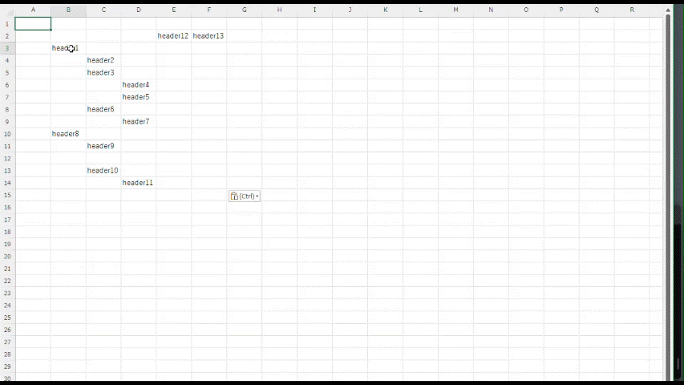
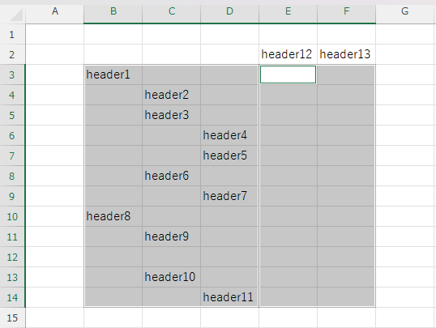
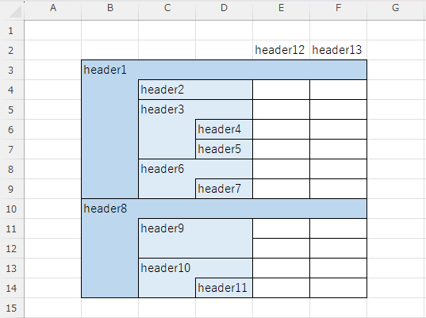

# PSExcelTreeTableStyler



PSExcelTreeTableStyler is a PowerShell script that styles Excel tables in a tree structure. It allows you to easily create a tree table in Excel by selecting multiple ranges and applying the styling.

## Usage

```powershell
# powershell

.\Invoke-ExcelTreeTableStyler.ps1
```

## Demonstration

- At first, launch Excel and create a new workbook. Then, fill in some data.



- Finally, select two ranges, B3:D14 and E3:F14, and run the Excel Tree Table Styler.
- You can see that the two ranges are treated as one table, and the tree structure is created based on the filled data. The cells with the same value in the same column are grouped together, and the borders are drawn to show the tree structure.



If you want to try it yourself, you can run the following code in PowerShell to launch Excel and fill in some data. 

```powershell
# powershell

git clone https://github.com/kumarstack55/PSExcelTreeTableStyler.git
Set-Location .\PSExcelTreeTableStyler\

# Launch Excel and create a new workbook.
$excel = New-Object -ComObject Excel.Application
$excel.Visible = $true
$workbook = $excel.Workbooks.Add()
$worksheet = $workbook.Worksheets.Item(1)

$range1 = $worksheet.Range("B2:F14")
$range1.Select()
$range1.Clear()

# Fill in some data
$worksheet.Range("B3").Value2 = "header1"
$worksheet.Range("C4").Value2 = "header2"
$worksheet.Range("C5").Value2 = "header3"
$worksheet.Range("D6").Value2 = "header4"
$worksheet.Range("D7").Value2 = "header5"
$worksheet.Range("C8").Value2 = "header6"
$worksheet.Range("D9").Value2 = "header7"
$worksheet.Range("B10").Value2 = "header8"
$worksheet.Range("C11").Value2 = "header9"
$worksheet.Range("C13").Value2 = "header10"
$worksheet.Range("D14").Value2 = "header11"
$worksheet.Range("E2").Value2 = "header12"
$worksheet.Range("F2").Value2 = "header13"

# Select two ranges. The first range is B3:D14, and the second range is E3:F14.
# If you want to select using your mouse, you can hold down the Ctrl key and select the two ranges.
$range1 = $worksheet.Range("B3:D14,E3:F14")
$range1.Select()

.\Invoke-ExcelTreeTableStyler.ps1
```

## Development

```powershell
# powershell

# Run tests.
Invoke-Pester
```

## LICENSE

MIT
